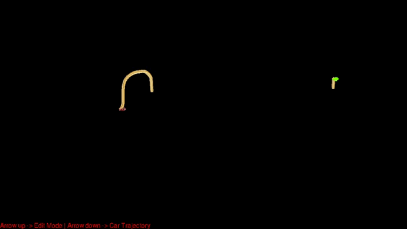
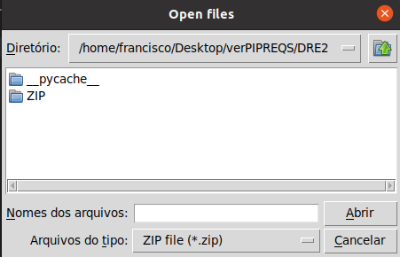
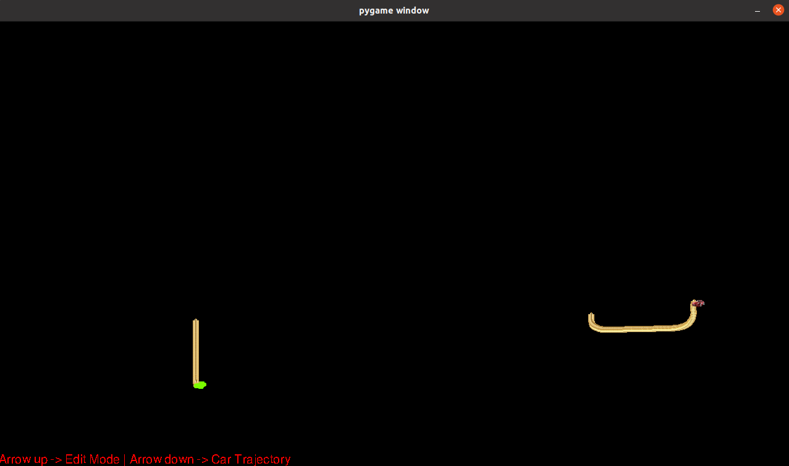
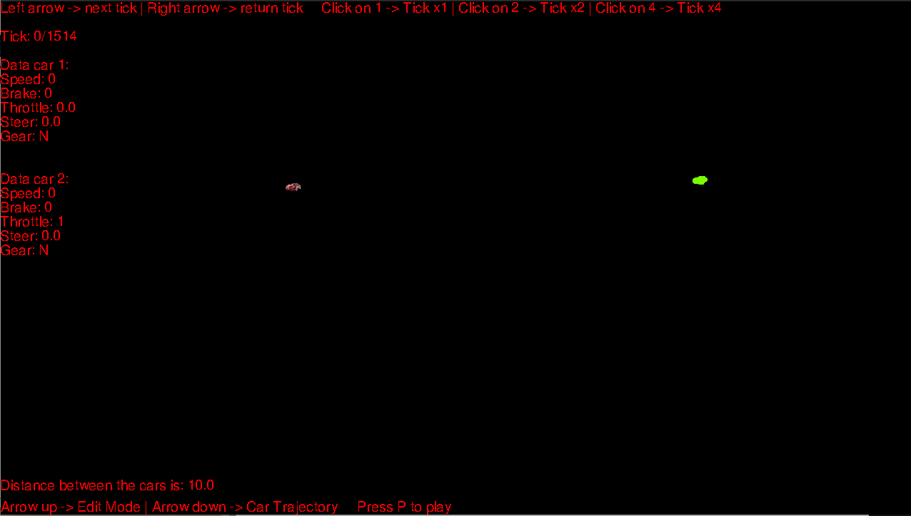
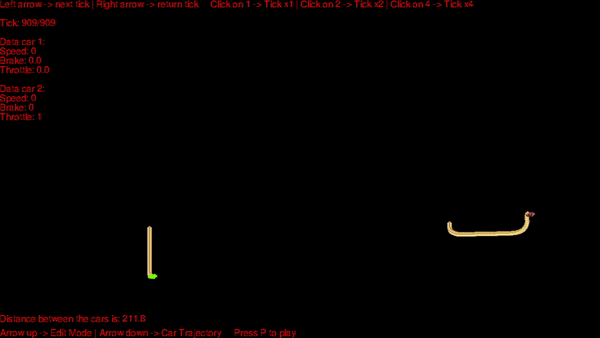

# CARLA Ego Vehicle - 2D Path's

# Summary

 - [Introduction](#Introduction)
 - [Goal](#Goal)
 - [Requirements](#Requirements)
   - [Installed software](#Installed-software)
     - [Python3.7](#Python3.7)
     - [Pip3](#Pip3)
   - [Libraries](#Libraries)
     - [Pygame](#Pyagme)
     - [Tkinter](#Tkinter)
     - [Pandas](#Pandas)
     - [Requirements.txt](#Requirements.txt)
 - [How to use the software](#How-to-use-the-software)
   - [Screen distance](#Screen-distance)
 - [Sofware screenshots](#Sofware-screenshots)
 - [What can be improved](#What-can-be-improved)
 - [Conclusion](#Conclusion)

# Introduction

- Internship work for the conclusion of my Software Application Development course at [TESP](http://www.ipg.pt/website/candidatos_tesp_geral.aspx).
- This project was developed during my professional internship at [Capgemini Engineering](https://capgemini-engineering.com/pt/pt-pt/), where I had the opportunity to participate in the V2X initiative at the Embedded and Software Critical Systems unit.

# Goal

The goals of the project are:

 - Visualize the paths of the vehicles.
 - Visualize information's about speed, braking, gear, steer and throttle of the vehicles depending on the tick in which we are.
 - Move through the tick to see the data of both cars at that moment.

# Requirements

The steps below were used with Ubuntu 20.04

## Installed software

### Python3.7

Update OS repositories
```
$ sudo apt update
```

Add new repository
```
$ sudo apt install software-properties-common
$ sudo add-apt-repository ppa:deadsnakes/ppa
```

Install Python 3.7
```
$ sudo apt-get install python3.7
```

### Pip3

Install Pip3
```
$ sudo apt-get -y install python3-pip
```

## Libraries

### Pygame

Install Pygame
```
$ sudo apt install python3.7-distutils
$ python3.7 -m pip install -U pygame==1.9.6 --user
```

### Tkinter

Install Tkinter
```
$ sudo apt-get install python3.7-tk
```

### Pandas

Install Pandas
```
$ python3.7 -m pip install -U pandas --user
```

### Requirements.txt

1. Get the "requirements.txt" file from the repository.
2. Inside the folder where you have the "dre2.py" file paste the "requirements.txt" file.
3. Right mouse click inside folder and click "Open in terminal".
4. Paste the following code and execute it.

```
$ python3.7 -m pip install -r requirements.txt
```

# How to use the software

 1. Create a new folder and inside it extract all the files
 2. Right mouse click inside folder and click "Open in terminal".
 3. To run the program paste the following code and execute it.
 ```
 $ python3.7 dr2.py
 ```
 4. The software will open a window for you to choose a ZIP file.
 5. In the "ZIP" folder we provide there are already some examples for the user to try.
 6. After the ZIP file is loaded the software initially opens with the path of two cars have taken.
 7. With the arrows, up and down, you can change between normal mode and edit mode.
 8. Inside edit mode you can control the car's path with the right and left arrow keys, thus moving through the different path positions of both cars.
 9. Using the 1,2 and 4 key you can control the value to be added to the tick.
 10. On edit mode if you press the P key you have access to an automatic player of the path of the two cars.
 11. You can also control the playback speed with the 1,3 and 7 keys.

**All keybinds to use software are spelled out in the program screen!**

## Screen distance

Using the mouse it is possible to click on two points on the screen and see the distance between them.



**This feature, to get correct values, should only be used between points on the same car path**

# Sofware screenshots

## Start screen

This is the first window you will see when run the software.



## Normal mode

This is the normal mode, where you can see all path of both cars.



## Edit mode

This is the edit mode, where you can control the position of cars on path.



## Info cars in a certain position 

This is the information you can see about the two cars on a certain position.


### Automatic play

This is the automatic player.



# Creating your own ZIP file 

To create your own ZIP file access the following link that will take you to the repository of the software that is required for its creation and follow the steps described there.

 - [Create ZIP software](https://github.com/FranciscoG001/CARLA-EgoVehicle-Simulation2Xlsx)

# What can be improved

One of the future details that could be applied to the project would be the implementation of a map of CARLA seen from above behind each path of the cars, so that we could also see where on the map the path of the car took place.

# Conclusion

This software emerged as part of Capgemini's V2X initiative project, with the ultimate goal of providing a 2D visualization of the data and paths taken by the cars during the CARLA simulation without the need to use it. 

In this project I had the help and collaboration of [Frederico Martins](https://github.com/fredpedroso), [Daniel Sader](https://github.com/danielpontello) and [Rédi Vildo]() from Capgemini.
